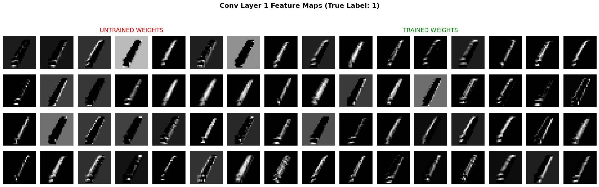
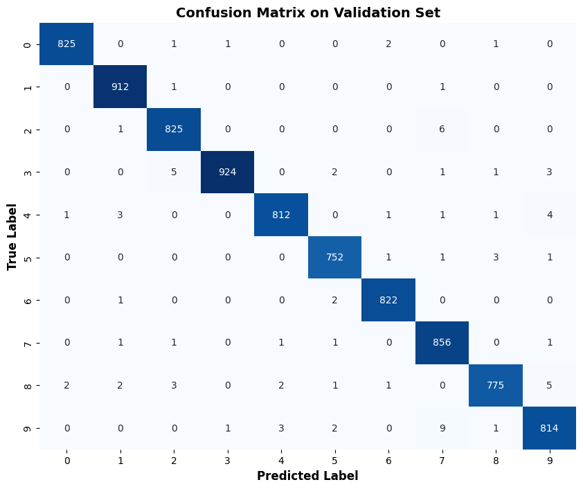
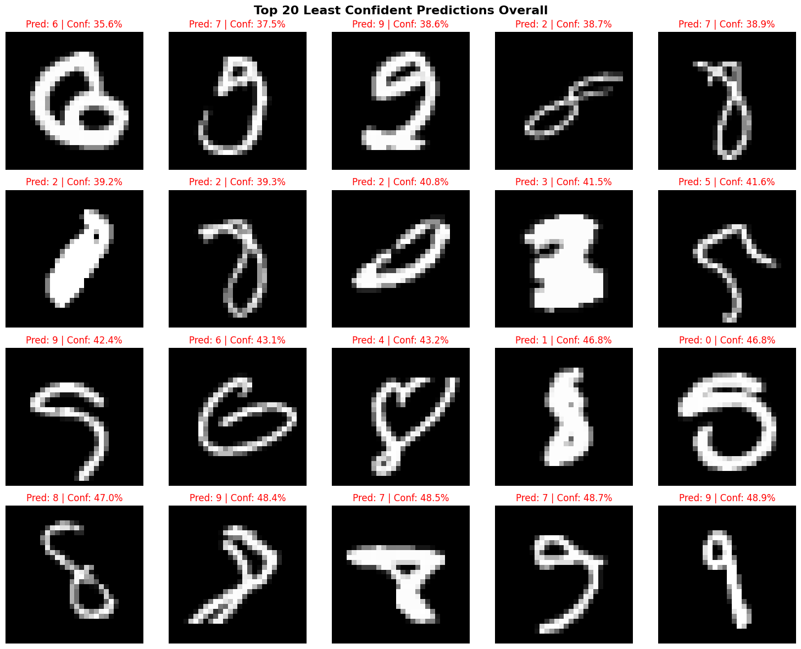

# Handwritten Digit Recognizer — CNN on Kaggle MNIST

A Convolutional Neural Network built from scratch in PyTorch to classify handwritten digits (0–9) using the Kaggle Digit Recognizer dataset. Trained with data augmentation and a learning rate scheduler to achieve **99.125% validation accuracy**.

---

## Results

| Metric | Value |
|--------|-------|
| Baseline validation accuracy | 98.85% |
| Final validation accuracy | 99.125% |
| Test set (Kaggle) | 28,000 images |
| Training epochs | 15 |

---

## What the Conv Layers Learn

After training, the first convolutional layer's 32 filters visibly learn to detect low-level features — edges, curves, and strokes. The second layer combines these into more abstract shapes.

**Layer 1 feature maps — untrained vs trained**



> Each tile is one of the 32 filters responding to the same input digit. Bright areas show where that filter activated strongly. Untrained filters produce noise. Trained filters produce structured, meaningful responses.

**Layer 2 feature maps — trained**

> Layer 2 filters operate on the output of Layer 1, so they detect combinations of edges rather than edges themselves — more abstract, less visually interpretable, but more powerful.

---

## Where the Model Struggles

**Confusion matrix — validation set**



> Rows are true labels, columns are predicted labels. The brighter the off-diagonal cell, the more often those two digits were confused. The hardest pairs are visually similar digits — 4/9, 3/8, and 7/2.

**20 least confident predictions**



> These are the 20 test images the model was least confident about. The confidence percentage shown is the probability assigned to the predicted digit. Low confidence usually reflects genuinely ambiguous handwriting rather than a model failure.

---

## Architecture

```
Input (1 × 28 × 28)
    ↓
Conv Layer 1      32 filters, 3×3, ReLU        → 32 × 26 × 26
Max Pool 1        2×2                           → 32 × 13 × 13
Conv Layer 2      64 filters, 3×3, ReLU        → 64 × 11 × 11
Max Pool 2        2×2                           → 64 × 5 × 5
Flatten                                         → 1600
Dense Layer       1600 → 128, ReLU
Dropout           p = 0.5
Output Layer      128 → 10
```

---

## Training Setup

| Parameter | Value | Why |
|-----------|-------|-----|
| Optimizer | Adam | Adapts learning rate per parameter automatically |
| Initial learning rate | 0.001 | Standard sweet spot for Adam |
| Scheduler | ReduceLROnPlateau | Reduces LR by 0.5× when val accuracy stalls for 2 epochs |
| Loss function | CrossEntropyLoss | Standard for multi-class classification |
| Batch size | 64 | Balance between speed and gradient stability |
| Epochs | 15 | Extra epochs to accommodate augmented data |
| Dropout | 0.5 | Heavier regularisation pairs well with augmentation |

**Data augmentation applied during training:**
- `RandomRotation(10°)` — digits are rarely perfectly upright in real handwriting
- `RandomAffine(translate=0.1)` — digits are rarely perfectly centered

---

## Experiments

All experiments are documented in `notebooks/experiments.ipynb` with accuracy curves and explanations.

| Experiment | Change | Val Accuracy | Outcome |
|------------|--------|-------------|---------|
| Baseline | dropout 0.5, no scheduler, no augmentation | 98.85% | Starting point |
| Exp 1 | dropout 0.25 | lower than baseline | Underfitting — too little regularisation |
| Exp 2 | ReduceLROnPlateau scheduler | improvement | Settles into deeper minimum |
| Exp 3 | Data augmentation | Best single improvement |
| Final | Augmentation + scheduler + dropout 0.5, 15 epochs | 99.05% | Most robust generalisation |


---

## Key Learnings

- Conv layers learn a hierarchy — edges first, then shapes, then digit-level features
- Dropout 0.5 outperformed 0.25 because data augmentation already provides regularisation — the two effects compound
- ReduceLROnPlateau is more effective than StepLR for this task because it reacts to actual training dynamics rather than a fixed schedule
- A model can be 99%+ accurate and still fail confidently on genuinely ambiguous handwriting — low confidence predictions are almost always explainable by looking at the image